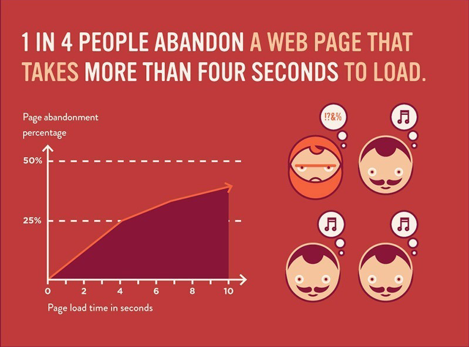

!SLIDE full-page subsection

# Fast vs Slow

<!SLIDE full-page title-slide transition=scrollUp>
# Programming is 90% thinking and 10% typing

<!SLIDE full-page title-slide transition=scrollUp>
# Several disagree and think that programming is just typing

<!SLIDE full-page title-slide transition=scrollUp>
# (I am not a fan of) Jeff Atwood

<!SLIDE full-page title-slide transition=scrollUp>
# Most software that have metrics measure activity like ODesk

<!SLIDE full-page title-slide transition=scrollUp>
# "You may be very active but not productive"
# @garybernhardt

<!SLIDE full-page title-slide transition=scrollUp>
# Good planning takes time but it's always worth it

<!SLIDE full-page title-slide transition=scrollUp>
# On going slowly
### "Do not be afraid of going slowly, be afraid only of standing still."

<!SLIDE full-page center  transition=scrollUp>

<!SLIDE full-page title-slide transition=scrollUp>
# A slow site is obviously a disadvantage

<!SLIDE full-page title-slide transition=scrollUp>
# Optimization is not a priority

<!SLIDE full-page title-slide transition=scrollUp>
> "We should forget about small efficiencies, say about 97% of the time: premature optimization is the root of all evil." — Donald Knuth

<!SLIDE full-page title-slide transition=scrollUp>
# Why do premature optimization?

<!SLIDE full-page center transition=fade>

<!SLIDE full-page title-slide transition=scrollUp>
# What is fast enough?

<!SLIDE full-page bullets incremental transition=fade>
* less than 0.1s/ 100ms - fast
* greater than 0.1s/ 100ms m - not snappy
* greater than 1s - feels sluggish
* greater than 10s - frustrating
* less than 3s - sane and easy to achieve

<!SLIDE full-page title-slide transition=scrollUp>
# Measuring Latency

<!SLIDE full-page bullets incremental transition=fade>
* http://tools.pingdom.com
* Facebook.com - 25 requests and loads in 831ms
* Google.com - 14 requests and loads in 743ms
* Yahoo.com - 83 requests and loads in 1.07s
* CNN.com - 189 requests and loads in 3.29s

!SLIDE full-page subsection

# 14 Rules for Better Web Performance

<!SLIDE full-page bullets incremental transition=fade>

* Make Fewer HTTP Requests

* Use a Content Delivery Network
  * Or use Rack::Cache if you do not want to pay for services
  * It is useless to use a CDN and Rack::Cache at the same time
  * Rack::Cache will not speed up asset delivery if you use a CDN

<!SLIDE full-page bullets incremental transition=fade>
* Add an Expires Header
  * For static components, set far future Expires header
  * For dynamic components, use Cache-Control header

<!SLIDE full-page bullets incremental transition=fade>
* Gzip Components
  * All browsers since 1998 support GZIP compression
  * Accept-Encoding: gzip, deflate

<!SLIDE full-page bullets transition=scrollUp>
	@@@ ruby
	# On a Rack project like Sinatra
	# config.ru
	use Rack::Deflater

<!SLIDE full-page bullets incremental transition=fade>
* Put Stylesheets at the Top
* Put JavaScripts at the Bottom
* Make JavaScript and CSS External

<!SLIDE full-page code small transition=scrollUp>
	@@@ ruby
	doctype 5
	html
	  head
      title A Basic Slim Template
      meta charset="utf-8"
      meta name="viewport" content="width=device-width, initial-scale=1.0"
      = stylesheet_link_tag 'application'
    body
      section
        article
          # A lot of code
      = javascript_include_tag 'application'

<!SLIDE full-page bullets incremental transition=fade>
* Avoid CSS Expressions
  * Write efficient CSS
  * Avoid the use of @import rule
  * Avoid complex child selectors that affect performance

<!SLIDE full-page transition=scrollUp>
	@@@ css
	// do not write this way
	div > div > div > p > a.class11 { }

<!SLIDE full-page bullets incremental transition=fade>
* Reduce DNS Lookups

!SLIDE full-page commandline incremental
	$ dig kat.pe

<!SLIDE full-page bullets incremental transition=fade>
* Minify JavaScript
  * Use an Asset Manager
  * Node.js - Connect Assets
  * Ruby on Rails/ Sinatra - Sprockets or "Asset Pipeline"

<!SLIDE full-page bullets incremental transition=fade>
* Minify Stylesheets
  * Use a CSS and JavaScript Compressor
  * YUI Compressor
  * CSS Condense (Node.js)

<!SLIDE full-page bullets incremental transition=fade>
* Avoid Redirects
* Remove Duplicate Scripts
  * Also suggests DRY/ Don't Repeat Yourself

<!SLIDE full-page bullets incremental transition=fade>
* Configure ETags
  * Rack::ETag

* Make Ajax Cacheable

<!SLIDE full-page bullets incremental transition=fade>
* Google Chrome Developer Tool
* Google PageSpeed Insights
  * https://developers.google.com/speed/pagespeed/insights
