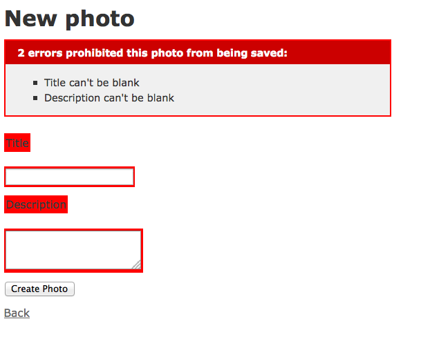

!SLIDE subsection
# Ruby on Rails Intro

<!SLIDE title-slide transition=scrollUp>
# Install Ruby on Rails

<!SLIDE full-page bullets incremental transition=scrollUp>
* Windows
 * http://railsinstaller.org

<!SLIDE full-page bullets incremental transition=scrollUp>
* Linux or Mac
  * http://www.blog.geekcampbaguio.com/2013-rails-install

!SLIDE full-page commandline incremental
	$ gem install rails
	$ rails -v
	$ Rails 4.0.1

<!SLIDE full-page bullets incremental transition=scrollUp>
* Create a simple photo management app
  * Upload photos
  * Add a title and/or description

!SLIDE commandline incremental
	$ rails new app
	$ cd app
	$ rails g scaffold photo title:string description:text
	$ rake db:migrate

<!SLIDE full-page title-slide transition=scrollUp>
	@@@ ruby
	# app/models/photo.rb

	class Photo < ActiveRecord::Base

	  validates :title, presence: true
	  validates :description, presence: true
	end

!SLIDE full-page commandline incremental
	$ rails s
	$ open http://localhost:3000/photos

<!SLIDE full-page transition=scrollUp>

!SLIDE full-page commandline incremental
	$ rails g migration add_picture_to_photo picture:string
	$ rake db:migrate

<!SLIDE full-page title-slide transition=scrollUp>
	@@@ ruby
	# app/views/photos/_form.html.erb

	

	  <%= f.label :picture %>
	  <%= f.file_field :picture %>
	

<!SLIDE full-page title-slide transition=scrollUp>
	@@@ ruby
	# app/views/photos/show.html.erb

	<%= image_tag(@photo.picture_url) %>

<!SLIDE full-page transition=scrollUp>
	@@@ ruby
	# app/controllers/photos_controller.rb

	  def photo_params
	    params.require(:photo).
      permit(:title, :description, :picture)
	  end

<!SLIDE full-page bullets incremental transition=scrollUp>
*  The Asset Pipeline
  * Allows easy management of static assets
  * Assets are precompiled for deployment

!SLIDE full-page commandline incremental
	$ rake assets:precompile RAILS_ENV=production

<!SLIDE full-page  bullets incremental transition=scrollUp>
* Assets are minified or compressed
  * YUI compressor - http://yui.github.io/yuicompressor/
  * uglifier - https://github.com/lautis/uglifier

<!SLIDE full-page bullets incremental transition=scrollUp>
* Performance Optimization for Ruby on Rails
  * Page Caching
  * Action Caching
  * Fragment Caching

<!SLIDE full-page bullets incremental transition=scrollUp>
* Resources
  * Web Performance Best Practices
    * https://developers.google.com/speed/docs/best-practices/rules_intro
  * 14 Rules for faster-loading websites
    * http://stevesouders.com/hpws/rules.php
  * Ruby on Rails documentation
    * http://guides.rubyonrails.org
  * Geekcamp Baguio Ruby on Rails Guide
    * http://rubyonrails.geekcampbaguio.com
